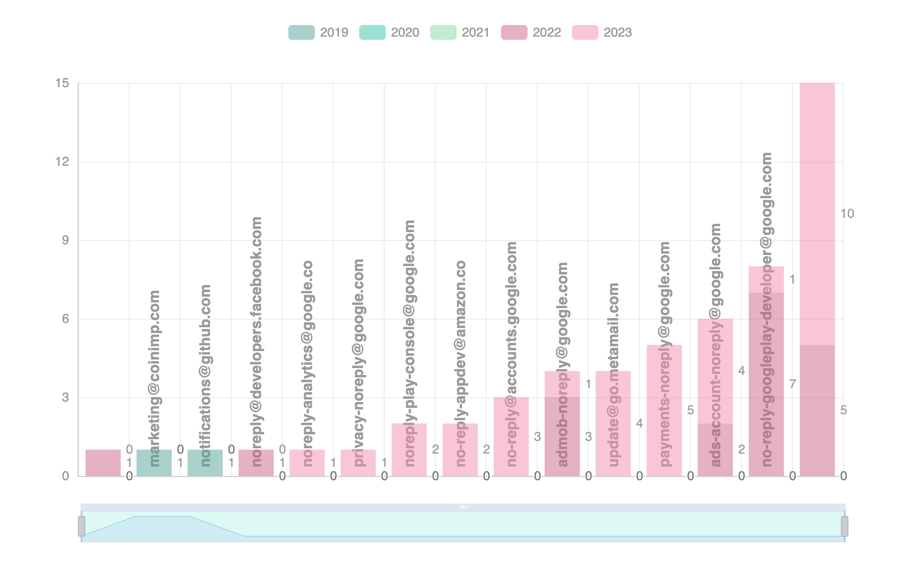

# Mbox Chart 📊

This tool will help with analyzing a busy email inbox visually by plotting aggregated email sender data into a bar chart. This tool is using [github.com/go-echarts/go-echarts](https://github.com/go-echarts/go-echarts).



## Usage

```bash
go install github.com/1pkg/mbox-chart@latest
mbox-chart ./path-to/email.mbox
```

## Licence

Licensed under the MIT License.
See [LICENSE](LICENSE) for the full license text.
